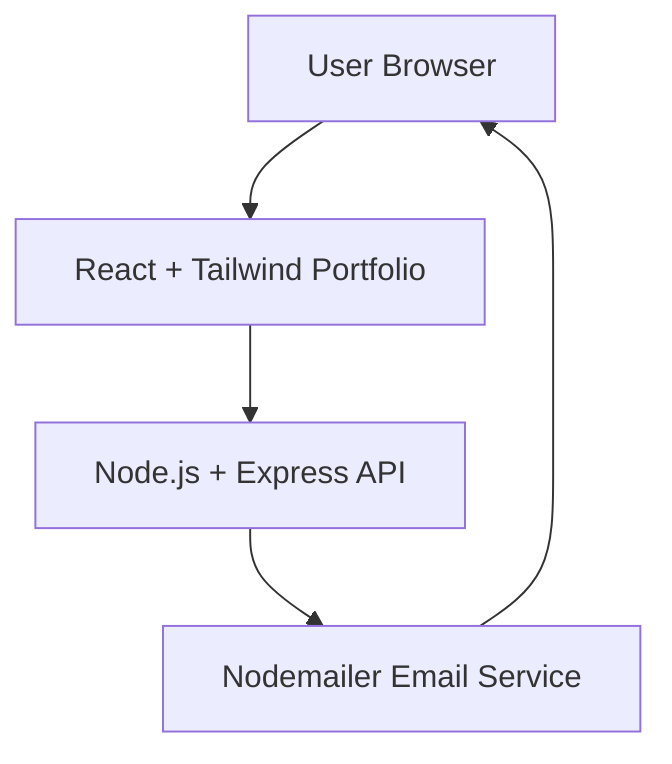

# 🌐 Personal Portfolio Website


A modern **full-stack developer portfolio** built with **React, Tailwind CSS, Node.js, and Express**.

The website showcases my **projects, skills, and experience**, and includes a **working contact form that sends messages through a backend API**.

---

# 🚀 Live Demo


---

# ✨ Features

* Modern responsive portfolio UI
* Animated sections and clean design
* Projects showcase
* Skills and technology stack
* Working **Contact Form with backend API**
* Email sending using **Nodemailer**
* Secure environment variables
* Clean and scalable folder structure

---

# 🛠️ Tech Stack

## Frontend

* React.js
* Tailwind CSS
* Vite
* Axios
* Lucide Icons

## Backend

* Node.js
* Express.js
* Nodemailer
* MongoDB (optional for storing messages)
* dotenv
* CORS

---

# ⚡ Architecture



---

# 🧠 API Endpoints

## Contact API

| Method | Endpoint     | Description                              |
| ------ | ------------ | ---------------------------------------- |
| POST   | /api/contact | Send message from portfolio contact form |

Example request:

```json
{
"name": "Rojalin",
"email": "rojalin@gmail.com",
"message": "Hello I saw your portfolio"
}
```

---

# 📂 Project Structure

```
portfolio
│
├── frontend
│   ├── src
│   │   ├── components
│   │   ├── sections
│   │   └── utils
│   │
│   └── package.json
│
├── backend
│   ├── controllers
│   ├── models
│   ├── routes
│   ├── server.js
│   └── .env
│
└── README.md
```

---

# ⚙️ Installation & Setup

## 1️⃣ Clone Repository

```bash
git clone https://github.com/yourusername/portfolio.git
cd portfolio
```

---

## 2️⃣ Backend Setup

```bash
cd backend
npm install
```

Create `.env`

```
PORT=4000
EMAIL_USER=your_email@gmail.com
EMAIL_PASS=your_app_password
```

Run server

```bash
node server.js
```

---

## 3️⃣ Frontend Setup

```bash
cd frontend
npm install
npm run dev
```

Frontend runs on:

```
http://localhost:5173
```

Backend runs on:

```
http://localhost:4000
```

---

# 🌍 Deployment

| Service  | Platform   |
| -------- | ---------- |
| Frontend | Vercel     |
| Backend  | Render     |
| Email    | Nodemailer |

---

# 👩‍💻 Author

**Rojalin Mohanty**

MCA Student
MERN Stack Developer

GitHub:
https://github.com/rosymohanty

---

# ⭐ Support

If you like this project, please **give it a star ⭐ on GitHub**.
